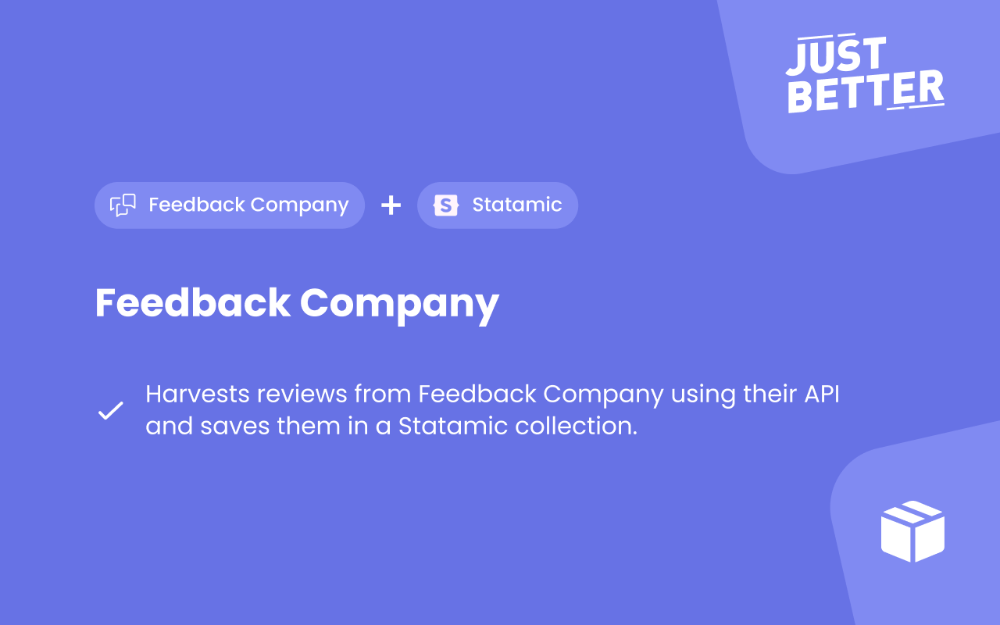

<a href="https://github.com/justbetter/statamic-feedback-company" title="JustBetter">
    
</a>

# Statamic Feedback Company

Harvests reviews from Feedback Company using their API and saves them in a Statamic collection.

## Installation

```
composer require justbetter/statamic-feedback-company
```

## How to Use

- Set up the `FEEDBACKCOMPANY_CLIENT_ID` and `FEEDBACKCOMPANY_CLIENT_SECRET` values in your `.env`
- Publish the blueprints (see below), then create the `Reviews` collection & `Reviews` global
- Now you can harvest the reviews with `php artisan reviews:harvest`

## API

If you don't want to use the statamic API, this addon provides a basic API with which you can retrieve the harvested reviews by doing a GET request to the following endpoint:

```
/api/feedback-company
```

This will return the 3 newest reviews in the collection. Some other possibilities:

```
/api/feedback-company?page=1&count=5
/api/feedback-company?count=5&minscore=2&maxscore=5
```

## ViewComposer

If you want to show some statistics about the reviews in your project, you can add the `ReviewsComposer` class as a viewcomposer to your specific component. You can add this in your serviceprovider:

```php
View::composer('rapidez::layouts.footer', ReviewsComposer::class);
```

This will expose a `$reviews` variable to your blade component with a few useful statistics. For example:

```
Our customers give us a {{ $reviews['score'] }}/10 across {{ $reviews['count'] }} reviews.
{{ $reviews['percentage'] }}% of reviews recommend us.
```

You can also use `$reviews['scores'][7]` to display how many reviews have a 7/10 rating.

## Tag

We integrated a Statamic Tag called `Reviews` which will allow you to get some basic data from the reviews like ratings and review content.

Blade example:

```php
Statamic::tag('reviews:get_rating_data')->fetch();
```

## Publishables

You can publish all of the publishables with:

```sh
php artisan vendor:publish --provider="JustBetter\StatamicFeedbackCompany\ServiceProvider"
```

Or publish them individually by using tags:

```sh
php artisan vendor:publish --provider="JustBetter\StatamicFeedbackCompany\ServiceProvider" --tag="blueprints"
php artisan vendor:publish --provider="JustBetter\StatamicFeedbackCompany\ServiceProvider" --tag="config"
```